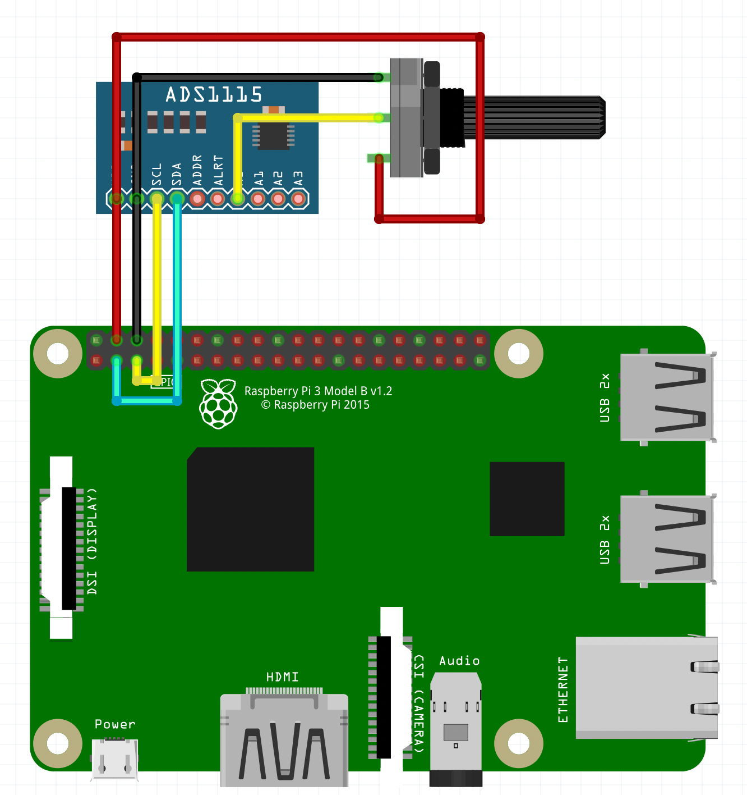
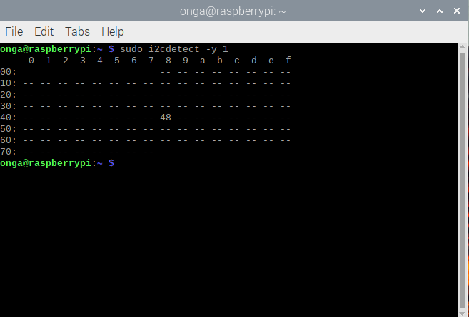

# ADS1115 with Raspberry pi 4 and I2C (BCM2835.h)

### Install BCM2835 Library
First of all u need to install BCM2835.h library (guide @ https://github.com/0nga/Bcm2835)

### Connect the components
Download the i2cADS1115.c source file, connect all the components as shown in the figure below



### I2C Interface

Make sure u have activated the I2C interface, if u are not sure, try this:

```bash
sudo raspi-config
```
go to interface options, and activate I2C.


### I2C Address
To see if the RPi see correctly ur I2C device, try this:

```bash
sudo apt-get install i2c-tools
sudo i2cdetect -y 1
```
that command will print out a matrix showing the addresses of all I2C devices currently connected to RPi as shown in the figure.




For ADS1115 the default address is 0x48, but u can change it by using the *addr pin*.
- Addr pin to GND -> 0x48
- Addr pin to Vin -> 0x49
- Addr pin to SDA -> 0x4A 
- Addr pin to SCL -> 0x4B

If the output is only made of dashed lines -> the I2C device is not working, or isn't connected properly (or u forgot to activate I2C interface!) 

### Reset i2c driver
If you somehow fucked up the i2c, run this terminal commands to reset it.

disable the I2C driver with
```bash
sudo rmmod i2c_dev
sudo rmmod i2c_bcm2708
```

re-enable it with
```bash
sudo modprobe i2c_bcm2708
sudo modprobe i2c_dev
```


