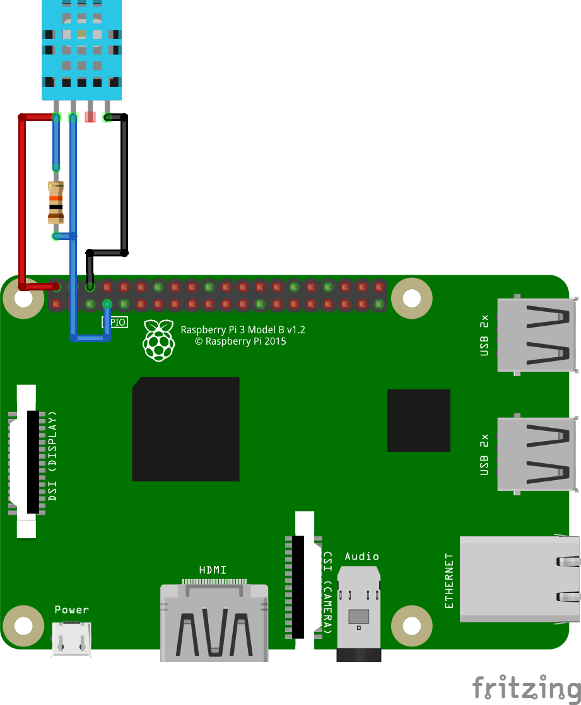
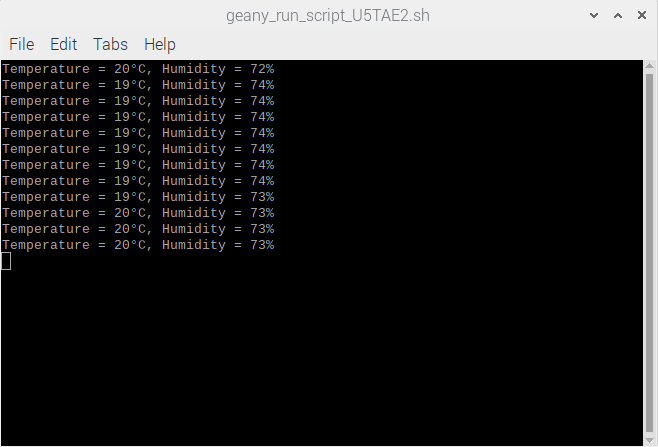

# DHT11-BCM2835
Read Temperature and Humidity using DHT11 sensor and BCM2835.h library for Raspberry Pi 4

### Install BCM2835 Library
First of all u need to install BCM2835.h library (guide @ [https://github.com/0nga/Raspberry-pi-4/tree/main/C%20Code/Bcm2835.h-Installation-Guide]

### Connect the components
Download the DHT11.c source file, connect all the components as shown in the figure below
(you can also add a 100nF capacitor between VDD and GND for power filtering, as written in the datasheet)

You must build/run the program as root to use the system timers. 

# Running program

